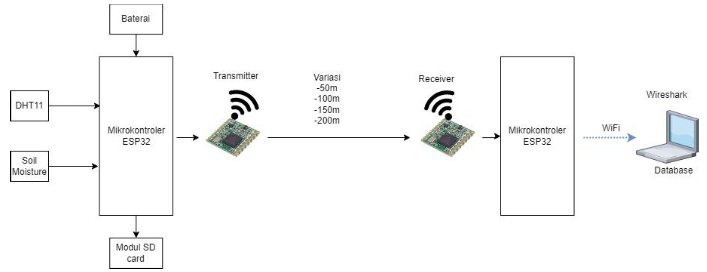
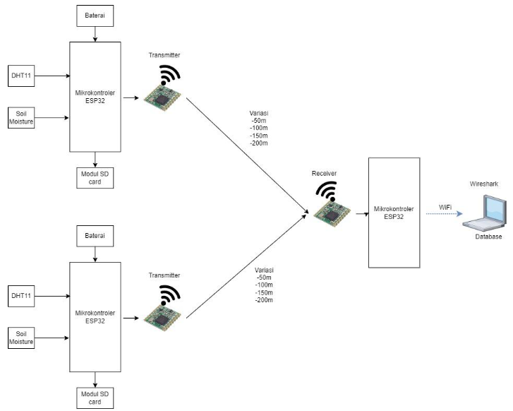
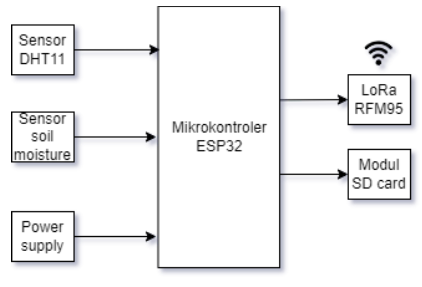
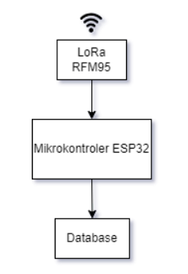

# LoRa-Based Wireless Sensor Network Monitoring System

This project is based on my final year Electrical Engineering project. It has been cleaned, simplified, and reorganized for portfolio purposes.

The system evaluates LoRa communication performance in a line-of-sight wireless sensor network using ESP32, LoRa RFM95, DHT11, soil moisture sensor, SD card logging, PHP, MySQL, and QoS analysis.

## Overview

This system collects environmental data from sensor nodes and transmits the data using LoRa communication. The receiver node receives LoRa packets and uploads the data to a database through WiFi using an HTTP POST request.

The project was tested under line-of-sight conditions with different distances and communication topologies.

## Communication Topologies

This project uses two LoRa communication topologies:

### 1. Point-to-Point Topology

One transmitter node sends sensor data to one receiver node.



### 2. Dual-Transmitter to Single-Receiver Topology

Two transmitter nodes send sensor data to one receiver node.



## Hardware Design

### Transmitter Node

The transmitter node reads sensor data, stores it in an SD card, and sends the data through LoRa.



Main components:

- ESP32 microcontroller
- LoRa RFM95 module
- DHT11 temperature and humidity sensor
- Soil moisture sensor
- SD card module
- Battery / power supply

### Receiver Node

The receiver node receives LoRa packets and uploads the data to the database through WiFi.



Main components:

- ESP32 microcontroller
- LoRa RFM95 module
- WiFi connection
- Local server / database

## Software and Tools

- Arduino IDE
- PHP
- MySQL / MariaDB
- XAMPP
- phpMyAdmin
- Wireshark
- Google Sheets / Microsoft Excel

## Arduino Libraries

- SPI
- LoRa
- WiFi
- HTTPClient
- NTPClient
- WiFiUdp
- DHT
- FS
- SD

## System Flow

```text
DHT11 Sensor + Soil Moisture Sensor
        ↓
ESP32 Transmitter
        ↓
SD Card Logging
        ↓
LoRa Communication
        ↓
ESP32 Receiver
        ↓
WiFi HTTP POST
        ↓
PHP Script
        ↓
MySQL Database
        ↓
QoS Analysis
```

## Data Collected

The system collects and stores the following data:

- Node type
- Counter
- Humidity
- Temperature
- Heat index
- Soil moisture
- RSSI

## QoS Parameters

The LoRa communication performance was evaluated using:

- Packet Delivery Ratio
- Packet Loss
- Delay
- Throughput
- RSSI

## Test Scenario

The system was tested in line-of-sight conditions using several distance variations:

- 50 meters
- 100 meters
- 150 meters
- 200 meters

## Result Highlights

### Point-to-Point Topology

Packet loss increased as the distance increased.

| Distance | Packet Loss |
|---|---:|
| 50 m | 23.88% |
| 100 m | 25.81% |
| 150 m | 29.15% |
| 200 m | 40.91% |

### Dual-Transmitter Topology

Packet loss was higher when two transmitters sent data to the same receiver.

| Topology | Packet Loss Range |
|---|---:|
| Two transmitters | 58%–66% |

### Overall Result

- Delay was more than 1 second.
- Throughput was categorized as very good because the system transmitted more than 100 bps.
- RSSI values changed depending on distance.
- Maximum RSSI: -96 dBm
- Minimum RSSI: -122 dBm
- Overall LoRa QoS performance was categorized as medium based on the TIPHON index.

## Project Structure

```text
lora-wsn-monitoring-system/
├── transmitter/
│   ├── transmitter.ino
│   └── config.example.h
├── receiver/
│   ├── receiver.ino
│   └── config.example.h
├── server/
│   ├── post-esp-data.php
│   └── config.example.php
├── database/
│   └── schema.sql
├── docs/
│   ├── README.md
│   ├── point-to-point-topology.png
│   ├── dual-transmitter-topology.png
│   └── transmitter-hardware-design.png
└── results/
    └── qos-summary.md
```

## Setup Notes

Sensitive information such as WiFi credentials, API keys, database passwords, and local IP addresses are not included in this repository.

Before running the project:

1. Copy `config.example.h` to `config.h` inside the transmitter and receiver folders.
2. Update the WiFi credentials and server URL.
3. Copy `config.example.php` to `config.php` inside the server folder.
4. Update the database name, username, password, and API key.
5. Import `database/schema.sql` into MySQL or MariaDB.
6. Upload the transmitter and receiver programs using Arduino IDE.
7. Run the PHP server using XAMPP or another local server environment.

## Note

This project was developed for academic research and portfolio purposes. The PHP backend is a simplified local testing script and is not intended for production use without additional security improvements.

---

# 日本語版

## LoRaベースのワイヤレスセンサネットワーク監視システム

このプロジェクトは、電気工学の卒業研究をもとに、ポートフォリオ用として整理・簡略化したものです。

ESP32、LoRa RFM95、DHT11温湿度センサ、土壌水分センサ、SDカード、PHP、MySQLを使用し、見通し環境におけるLoRa通信性能を評価しました。

## 概要

本システムは、センサノードから環境データを取得し、LoRa通信を用いて受信ノードへ送信します。受信ノードはLoRaパケットを受信した後、WiFi経由でHTTP POSTリクエストを送信し、PHPスクリプトを通してMySQLデータベースへデータを保存します。

## 通信トポロジー

本プロジェクトでは、以下の2種類のLoRa通信トポロジーを使用しました。

### 1. Point-to-Point トポロジー

1台の送信ノードから1台の受信ノードへセンサデータを送信します。

### 2. 2送信機・1受信機トポロジー

2台の送信ノードから1台の受信ノードへセンサデータを送信します。

## ハードウェア構成

### 送信ノード

送信ノードはセンサデータを読み取り、SDカードへ保存し、LoRa通信で受信ノードへ送信します。

主な構成部品：

- ESP32 マイコン
- LoRa RFM95 モジュール
- DHT11 温湿度センサ
- 土壌水分センサ
- SDカードモジュール
- バッテリー / 電源

### 受信ノード

受信ノードはLoRaパケットを受信し、WiFiを使用してデータベースへデータを送信します。

主な構成部品：

- ESP32 マイコン
- LoRa RFM95 モジュール
- WiFi接続
- ローカルサーバ / データベース

## 使用技術・ツール

- Arduino IDE
- PHP
- MySQL / MariaDB
- XAMPP
- phpMyAdmin
- Wireshark
- Google Sheets / Microsoft Excel

## Arduinoライブラリ

- SPI
- LoRa
- WiFi
- HTTPClient
- NTPClient
- WiFiUdp
- DHT
- FS
- SD

## システムの流れ

```text
DHT11センサ + 土壌水分センサ
        ↓
ESP32送信ノード
        ↓
SDカードへ保存
        ↓
LoRa通信
        ↓
ESP32受信ノード
        ↓
WiFi HTTP POST
        ↓
PHPスクリプト
        ↓
MySQLデータベース
        ↓
QoS分析
```

## 取得データ

本システムでは以下のデータを取得します。

- ノード種別
- カウンター
- 湿度
- 温度
- 体感温度指数
- 土壌水分
- RSSI

## QoS評価項目

LoRa通信性能は以下の項目で評価しました。

- Packet Delivery Ratio
- Packet Loss
- Delay
- Throughput
- RSSI

## 試験条件

見通し環境で以下の距離を用いて試験を行いました。

- 50 m
- 100 m
- 150 m
- 200 m

## 結果概要

### Point-to-Point トポロジー

距離が長くなるにつれて、パケットロスが増加しました。

| 距離 | Packet Loss |
|---|---:|
| 50 m | 23.88% |
| 100 m | 25.81% |
| 150 m | 29.15% |
| 200 m | 40.91% |

### 2送信機トポロジー

2台の送信機から同じ受信機へ送信した場合、パケットロスが高くなりました。

| トポロジー | Packet Loss |
|---|---:|
| 2送信機 | 58%–66% |

### 全体結果

- Delayは1秒以上でした。
- Throughputは100 bps以上であり、非常に良いカテゴリでした。
- RSSIは距離によって変化しました。
- 最大RSSI：-96 dBm
- 最小RSSI：-122 dBm
- TIPHON指標に基づく全体的なLoRa通信性能は「中程度」と評価されました。

## 注意

WiFiパスワード、APIキー、データベースパスワード、ローカルIPアドレスなどの機密情報は、このリポジトリには含めていません。

このプロジェクトは、学術研究およびポートフォリオ目的で整理したものです。PHPバックエンドはローカル環境での簡易テスト用であり、本番環境で利用する場合は追加のセキュリティ対策が必要です。
